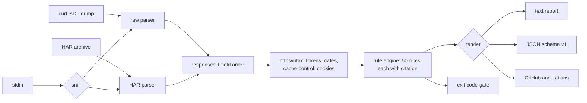

# hdrlint

[English](README.md) | [中文](README.zh.md) | [日本語](README.ja.md)

[](LICENSE) [](go.mod) [](CHANGELOG.md)  [](CONTRIBUTING.md)

**hdrlint：HTTP レスポンスヘッダのセキュリティ・キャッシュ・仕様違反をオフラインで検査するオープンソースの依存ゼロ CLI——CI ネイティブで、すべての指摘に RFC の出典付き。**


```bash
git clone https://github.com/JaydenCJ/hdrlint && cd hdrlint
go build -o hdrlint ./cmd/hdrlint    # single static binary, stdlib only
```

> プレリリース：v0.1.0 はまだどのレジストリにも公開していません。上記のとおりソースからビルドしてください（Go ≥1.22 なら可）。

## なぜ hdrlint？

いまのヘッダ監査といえば、本番 URL を securityheaders.com や Mozilla Observatory に貼り付けること——SaaS は公開到達可能なものしか見えず、採点はセキュリティヘッダだけ、しかもリグレッションが実際に生まれる CI では走れません。一方で、プラットフォームチームを午前 3 時に叩き起こす二つの領域——キャッシュ（`no-store, max-age=600` が CDN に配信される、引用符なしの ETag が再検証を静かに殺す）とプロトコル正しさ（`Content-Length` と `Transfer-Encoding` の併存、まさにリクエストスマグリングの形）——を検査するヘッダツールは存在しませんでした。hdrlint は手元にあるキャプチャ（`curl -sD -`、リダイレクトチェーン、devtools の HAR エクスポート）を完全オフラインで検査し、50 のルールで三領域すべてをカバーし、「雰囲気ツール」であることを拒みます：すべての指摘が、それを真にする RFC の節（または WHATWG/W3C 標準）を引用するので、レビューの議論は論争ではなくリンクで終わります。

| | hdrlint | securityheaders.com | Mozilla Observatory | helmet 系ミドルウェア |
|---|---|---|---|---|
| オフライン / CI で動作、公開 URL 不要 | ✅ | ❌ SaaS | ❌ SaaS | n/a |
| キャッシュ規則（Cache-Control 矛盾、ETag、Vary） | ✅ 14 件 | ❌ | ❌ | ❌ |
| 仕様正しさ規則（スマグリング形、日付、フレーミング） | ✅ 16 件 | ❌ | ❌ | ❌ |
| 指摘ごとの出典 | ✅ RFC 節 + リンク | ❌ 評価レター | 一部ドキュメントリンク | ❌ |
| 機械可読出力 + 終了コード | ✅ JSON・GitHub 注釈 | ❌ | API のみ | n/a |
| HAR / リダイレクトチェーン / stdin 対応 | ✅ | ❌ 単一 URL | ❌ 単一 URL | n/a |
| ランタイム依存 | 0（Go 標準ライブラリ） | n/a | n/a | npm ツリー |

<sub>依存数の確認日 2026-07-12：hdrlint がインポートするのは Go 標準ライブラリのみ。helmet は Express アプリでヘッダを*設定する*ものであり、エッジが実際に返すものは監査できません。</sub>

## 特長

- **すべての指摘が仕様を引用** —— `etag-malformed … [RFC 9110 §8.8.3]`。JSON 出力には rfc-editor の URL、`hdrlint explain <rule>` は修正アドバイスを表示。意見ではなく論拠を。
- **セキュリティの先へ** —— セキュリティ 20 規則（HSTS、CSP スクリプトポリシー解析、Cookie 属性、CORS 資格情報）、キャッシュ 14 規則（ディレクティブ矛盾、delta-seconds 文法、綴り間違い、引用符なし ETag）、正しさ 16 規則（CL+TE スマグリング形、単一ヘッダの重複、HTTP 日付形式、obs-fold）。
- **構造からしてオフライン** —— 生の `curl -i` / `curl -sD -` ダンプ、`-L` リダイレクトチェーンの各ホップ、devtools のヘッダ貼り付け、エントリ単位で HTTPS を判定する HAR を検査。hdrlint 自身はソケットを一切開きません。
- **CI ネイティブ** —— 終了コード 0/1/2/3、段階導入のための `--fail-on error|warn|info|never` しきい値、marketplace action 不要で workflow-command 注釈を出す `--format github`。
- **精密で、うるさくない** —— ルールは文脈を理解します：nonce/hash があれば `'unsafe-inline'` は許容、304 の Content-Length は合法、`Last-Modified` は（壁時計ではなく）`Date` ヘッダとだけ比較、HTTPS 限定規則は `--http` キャプチャでは沈黙。
- **依存ゼロ・完全決定的** —— Go 標準ライブラリのみ。同じ入力はバイト単位で同じレポートに。テレメトリなし、ネットワークなし、永遠に。

## クイックスタート

```bash
hdrlint check examples/bad.txt      # or: curl -sD - -o /dev/null https://example.test/ | hdrlint check -
```

実際にキャプチャした出力：

```text
examples/bad.txt#1  HTTP/1.1 200 OK
  error cache-no-store-conflict   no-store contradicts max-age in the same Cache-Control policy  [RFC 9111 §5.2.2.5]
  error cookie-no-secure          cookie "session" is set without the Secure attribute on an HTTPS response  [RFC 6265 §4.1.2.5]
  error etag-malformed            ETag value 33a64df551425fcc is not a valid entity-tag (must be a quoted string, optionally W/-prefixed)  [RFC 9110 §8.8.3]
  warn  cookie-no-samesite        cookie "session" has no SameSite attribute (cross-site behavior is left to browser defaults)  [RFC 6265bis §4.1.2.7]
  warn  expires-invalid           Expires value "0" is not a valid HTTP-date; caches treat it as already expired  [RFC 9111 §5.3]
  warn  hsts-missing              Strict-Transport-Security is not set on an HTTPS response  [RFC 6797 §7.1]
  warn  nosniff-missing           X-Content-Type-Options is not set (browsers may MIME-sniff the body)  [WHATWG Fetch]
  info  csp-missing               HTML response has no Content-Security-Policy  [W3C CSP3]
  info  expires-ignored           Expires is present but Cache-Control max-age wins; recipients must ignore Expires  [RFC 9111 §5.3]
  info  frame-protection-missing  HTML response has neither CSP frame-ancestors nor X-Frame-Options (clickjacking is possible)  [RFC 7034 §2.1]
  info  referrer-policy-missing   HTML response has no Referrer-Policy; full URLs may leak in the Referer header  [W3C Referrer Policy]
  info  server-version            Server value "Apache/2.4.62 (Ubuntu)" reveals a product version  [RFC 9110 §10.2.4]

checked 1 response against 50 rules: 3 errors, 4 warnings, 5 notices
```

ルールが*なぜ*あるのかを聞く（`hdrlint explain`、実際の出力）：

```text
etag-malformed  (caching, error)

  ETag is not a valid entity-tag.

  An entity-tag is an optionally W/-prefixed double-quoted string. Unquoted ETags (a common framework bug) break If-None-Match comparison at strict caches and CDNs, silently disabling conditional revalidation.

  citation: RFC 9110 §8.8.3
  https://www.rfc-editor.org/rfc/rfc9110#section-8.8.3
```

## ルール

3 カテゴリ計 50 規則——出典付きの完全な表は [docs/rules.md](docs/rules.md) に、`hdrlint rules` はバイナリ自身から同じ表を出力します。

| カテゴリ | 規則数 | 例 | 依拠する仕様 |
|---|---|---|---|
| security | 20 | `hsts-missing`、`csp-unsafe-inline`、`cookie-no-secure`、`cors-wildcard-credentials` | RFC 6797、RFC 6265(bis)、RFC 7034、WHATWG Fetch、W3C CSP3 |
| caching | 14 | `cache-no-store-conflict`、`etag-malformed`、`vary-wildcard`、`expires-invalid` | RFC 9111、RFC 9110、RFC 5861、RFC 8246 |
| correctness | 16 | `content-length-transfer-encoding`、`duplicate-singleton`、`date-invalid`、`obs-fold` | RFC 9110、RFC 9112、WHATWG HTML |

## CI での使い方

`hdrlint check [flags] <capture>...` —— キャプチャは生ヘッダダンプまたは HAR ファイル、`-` は stdin を読みます（[docs/inputs.md](docs/inputs.md)）。終了コード：0 クリーン、1 しきい値以上の指摘あり、2 使い方の誤り、3 入力が読めない。

| フラグ | 既定値 | 効果 |
|---|---|---|
| `--format` | `text` | `text`、`json`（安定した `schema_version: 1`）、`github`（Actions 注釈） |
| `--fail-on` | `error` | 失敗と判定する最低の重大度：`error`、`warn`、`info`、`never`（レポートのみ） |
| `--disable` | — | id 指定でルールを除外（繰り返し可。未知の id は拒否され、タイポは即座に露見） |
| `--only` | — | 指定ルールのみ実行（繰り返し可） |
| `--http` | オフ | 平文 HTTP のキャプチャ：HTTPS 限定規則を飛ばし、`hsts-over-http` を有効化 |

GitHub Actions への 3 行レシピは [examples/ci-gate.sh](examples/ci-gate.sh) を参照。

## 検証

このリポジトリは CI を同梱しません。上記の主張はすべてローカル実行で検証しています：

```bash
go test ./...            # 88 deterministic tests, offline, < 5 s
bash scripts/smoke.sh    # end-to-end CLI check, prints SMOKE OK
```

## アーキテクチャ



## ロードマップ

- [x] v0.1.0 —— セキュリティ/キャッシュ/正しさの出典付き 50 規則、raw + HAR + stdin 入力、リダイレクトチェーン対応、text/JSON/GitHub 出力、fail-on しきい値、`rules`/`explain` サブコマンド、88 テスト + smoke スクリプト
- [ ] 設定ファイル（`.hdrlint.toml`）でパス別ルールプロファイル（静的アセット vs API vs HTML）
- [ ] `--baseline` スナップショットモード：前回承認済みレポート以降の新規指摘のみ失敗に
- [ ] Diff モード：二つのキャプチャを比較し、増減した指摘を報告
- [ ] ペアの HAR エントリからのリクエスト側規則（条件付きヘッダ、禁止リクエストフィールド）
- [ ] structured-field 採用ヘッダへの RFC 8941 文法検証

完全なリストは [open issues](https://github.com/JaydenCJ/hdrlint/issues) へ。

## コントリビュート

Issue・ディスカッション・PR を歓迎します——ローカルの作業フロー（format、vet、テスト、`SMOKE OK`）とルール追加の条件（出典必須）は [CONTRIBUTING.md](CONTRIBUTING.md) を参照。入門向けタスクは [good first issue](https://github.com/JaydenCJ/hdrlint/issues?q=is%3Aissue+is%3Aopen+label%3A%22good+first+issue%22)、設計の議論は [Discussions](https://github.com/JaydenCJ/hdrlint/discussions) で。

## ライセンス

[MIT](LICENSE)
