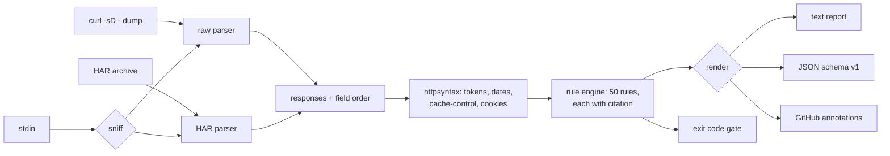

# hdrlint

[English](README.md) | [中文](README.zh.md) | [日本語](README.ja.md)

[](LICENSE) [](go.mod) [](CHANGELOG.md)  [](CONTRIBUTING.md)

**hdrlint：an open-source, zero-dependency CLI that lints HTTP response headers for security, caching, and spec violations — offline, CI-native, with an RFC citation for every finding.**


```bash
git clone https://github.com/JaydenCJ/hdrlint && cd hdrlint
go build -o hdrlint ./cmd/hdrlint    # single static binary, stdlib only
```

> Pre-release: v0.1.0 is not tagged on a package registry yet; build from source as above (any Go ≥1.22).

## Why hdrlint?

Header audits today mean pasting a production URL into securityheaders.com or Mozilla Observatory — a SaaS that can only see what is publicly reachable, only grades security headers, and cannot run in CI where regressions are actually introduced. Meanwhile the two categories that page platform teams at 3 a.m. — caching (`no-store, max-age=600` shipped to a CDN, an unquoted ETag silently disabling revalidation) and protocol correctness (`Content-Length` next to `Transfer-Encoding`, the exact shape of request smuggling) — are audited by no header tool at all. hdrlint lints captures you already have (`curl -sD -`, redirect chains, devtools HAR exports) completely offline, covers all three categories with 50 rules, and refuses to be a vibes tool: every finding cites the RFC section (or WHATWG/W3C standard) that makes it true, so review threads end with a link instead of a debate.

| | hdrlint | securityheaders.com | Mozilla Observatory | helmet-style middleware |
|---|---|---|---|---|
| Works offline / in CI, no public URL needed | ✅ | ❌ SaaS | ❌ SaaS | n/a |
| Caching rules (Cache-Control conflicts, ETag, Vary) | ✅ 14 rules | ❌ | ❌ | ❌ |
| Spec-correctness rules (smuggling shapes, dates, framing) | ✅ 16 rules | ❌ | ❌ | ❌ |
| Citation per finding | ✅ RFC §, linked | ❌ grade letters | partial docs links | ❌ |
| Machine-readable output + exit codes | ✅ JSON, GitHub annotations | ❌ | API only | n/a |
| Lints HAR / redirect chains / stdin | ✅ | ❌ single URL | ❌ single URL | n/a |
| Runtime dependencies | 0 (Go stdlib) | n/a | n/a | npm tree |

<sub>Dependency count checked 2026-07-12: hdrlint imports the Go standard library only. helmet *sets* headers in Express apps; it cannot audit what your edge actually serves.</sub>

## Features

- **Every finding cites its spec** — `etag-malformed … [RFC 9110 §8.8.3]`, with the rfc-editor URL in JSON output and `hdrlint explain <rule>` printing the remediation advice. Arguments, not opinions.
- **Beyond security** — 20 security rules (HSTS, CSP script-policy analysis, cookie attributes, CORS credentials), 14 caching rules (directive conflicts, delta-seconds grammar, typo'd directives, unquoted ETags), 16 correctness rules (CL+TE smuggling shapes, singleton duplicates, HTTP-date forms, obs-fold).
- **Offline by construction** — lints raw `curl -i` / `curl -sD -` dumps, full `-L` redirect chains hop by hop, devtools header pastes, and HAR archives with per-entry HTTPS detection. hdrlint itself never opens a socket.
- **CI-native** — exit codes 0/1/2/3, a `--fail-on error|warn|info|never` threshold for incremental adoption, and `--format github` emitting workflow-command annotations with no marketplace action.
- **Precise, not noisy** — rules know their context: nonce/hash makes `'unsafe-inline'` fine, 304 may carry Content-Length, `Last-Modified` is compared against the `Date` header (never the wall clock), HTTPS-only rules stay quiet for `--http` captures.
- **Zero dependencies, fully deterministic** — Go standard library only; identical input produces byte-identical reports. No telemetry, no network, ever.

## Quickstart

```bash
hdrlint check examples/bad.txt      # or: curl -sD - -o /dev/null https://example.test/ | hdrlint check -
```

Real captured output:

```text
examples/bad.txt#1  HTTP/1.1 200 OK
  error cache-no-store-conflict   no-store contradicts max-age in the same Cache-Control policy  [RFC 9111 §5.2.2.5]
  error cookie-no-secure          cookie "session" is set without the Secure attribute on an HTTPS response  [RFC 6265 §4.1.2.5]
  error etag-malformed            ETag value 33a64df551425fcc is not a valid entity-tag (must be a quoted string, optionally W/-prefixed)  [RFC 9110 §8.8.3]
  warn  cookie-no-samesite        cookie "session" has no SameSite attribute (cross-site behavior is left to browser defaults)  [RFC 6265bis §4.1.2.7]
  warn  expires-invalid           Expires value "0" is not a valid HTTP-date; caches treat it as already expired  [RFC 9111 §5.3]
  warn  hsts-missing              Strict-Transport-Security is not set on an HTTPS response  [RFC 6797 §7.1]
  warn  nosniff-missing           X-Content-Type-Options is not set (browsers may MIME-sniff the body)  [WHATWG Fetch]
  info  csp-missing               HTML response has no Content-Security-Policy  [W3C CSP3]
  info  expires-ignored           Expires is present but Cache-Control max-age wins; recipients must ignore Expires  [RFC 9111 §5.3]
  info  frame-protection-missing  HTML response has neither CSP frame-ancestors nor X-Frame-Options (clickjacking is possible)  [RFC 7034 §2.1]
  info  referrer-policy-missing   HTML response has no Referrer-Policy; full URLs may leak in the Referer header  [W3C Referrer Policy]
  info  server-version            Server value "Apache/2.4.62 (Ubuntu)" reveals a product version  [RFC 9110 §10.2.4]

checked 1 response against 50 rules: 3 errors, 4 warnings, 5 notices
```

Ask *why* a rule exists (`hdrlint explain`, real output):

```text
etag-malformed  (caching, error)

  ETag is not a valid entity-tag.

  An entity-tag is an optionally W/-prefixed double-quoted string. Unquoted ETags (a common framework bug) break If-None-Match comparison at strict caches and CDNs, silently disabling conditional revalidation.

  citation: RFC 9110 §8.8.3
  https://www.rfc-editor.org/rfc/rfc9110#section-8.8.3
```

## Rules

50 rules in three categories — the full table with citations lives in [docs/rules.md](docs/rules.md), and `hdrlint rules` prints it from the binary itself.

| Category | Rules | Examples | Governing specs |
|---|---|---|---|
| security | 20 | `hsts-missing`, `csp-unsafe-inline`, `cookie-no-secure`, `cors-wildcard-credentials` | RFC 6797, RFC 6265(bis), RFC 7034, WHATWG Fetch, W3C CSP3 |
| caching | 14 | `cache-no-store-conflict`, `etag-malformed`, `vary-wildcard`, `expires-invalid` | RFC 9111, RFC 9110, RFC 5861, RFC 8246 |
| correctness | 16 | `content-length-transfer-encoding`, `duplicate-singleton`, `date-invalid`, `obs-fold` | RFC 9110, RFC 9112, WHATWG HTML |

## CI usage

`hdrlint check [flags] <capture>...` — captures are raw header dumps or HAR files, `-` reads stdin ([docs/inputs.md](docs/inputs.md)). Exit codes: 0 clean, 1 findings at/above threshold, 2 usage error, 3 unreadable input.

| Flag | Default | Effect |
|---|---|---|
| `--format` | `text` | `text`, `json` (stable `schema_version: 1`), or `github` (Actions annotations) |
| `--fail-on` | `error` | lowest severity that fails the run: `error`, `warn`, `info`, or `never` (report-only) |
| `--disable` | — | skip a rule by id (repeatable; unknown ids are rejected, so typos fail loudly) |
| `--only` | — | run only the named rules (repeatable) |
| `--http` | off | capture was served over plain HTTP: skips HTTPS-only rules, enables `hsts-over-http` |

See [examples/ci-gate.sh](examples/ci-gate.sh) for the three-line GitHub Actions recipe.

## Verification

This repository ships no CI; every claim above is verified by local runs:

```bash
go test ./...            # 88 deterministic tests, offline, < 5 s
bash scripts/smoke.sh    # end-to-end CLI check, prints SMOKE OK
```

## Architecture



## Roadmap

- [x] v0.1.0 — 50 cited rules across security/caching/correctness, raw + HAR + stdin inputs, redirect-chain support, text/JSON/GitHub output, fail-on thresholds, `rules`/`explain` subcommands, 88 tests + smoke script
- [ ] Config file (`.hdrlint.toml`) for per-path rule profiles (static assets vs API vs HTML)
- [ ] `--baseline` snapshot mode: fail only on findings new since the last accepted report
- [ ] Diff mode: compare two captures and report which findings appeared or disappeared
- [ ] Request-side rules (conditional headers, forbidden request fields) from paired HAR entries
- [ ] Structured-field syntax validation (RFC 8941) for headers that adopt it

See the [open issues](https://github.com/JaydenCJ/hdrlint/issues) for the full list.

## Contributing

Issues, discussions and pull requests are welcome — see [CONTRIBUTING.md](CONTRIBUTING.md) for the local workflow (format, vet, tests, `SMOKE OK`) and the rules for adding a rule (citation required). Good entry points are labelled [good first issue](https://github.com/JaydenCJ/hdrlint/issues?q=is%3Aissue+is%3Aopen+label%3A%22good+first+issue%22), and design questions live in [Discussions](https://github.com/JaydenCJ/hdrlint/discussions).

## License

[MIT](LICENSE)
