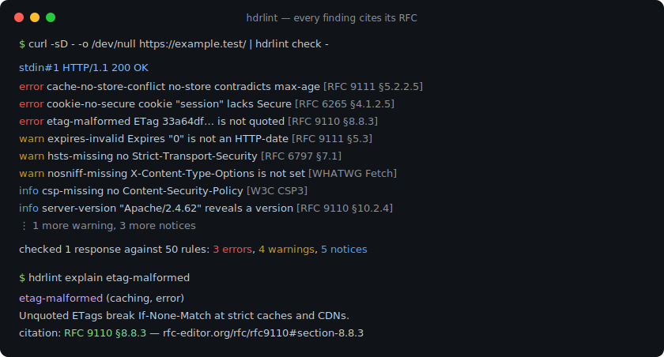
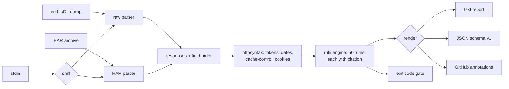

# hdrlint

[English](README.md) | [中文](README.zh.md) | [日本語](README.ja.md)

[](LICENSE) [](go.mod) [](CHANGELOG.md)  [](CONTRIBUTING.md)

**hdrlint：一个开源、零依赖的 CLI，离线审计 HTTP 响应头的安全、缓存与协议规范问题——CI 原生，每条发现都附带 RFC 出处。**



```bash
git clone https://github.com/JaydenCJ/hdrlint && cd hdrlint
go build -o hdrlint ./cmd/hdrlint    # single static binary, stdlib only
```

> 预发布说明：v0.1.0 尚未发布到任何包仓库；请按上述方式从源码构建（Go ≥1.22 即可）。

## 为什么选 hdrlint？

如今做响应头审计，通常是把生产 URL 粘贴到 securityheaders.com 或 Mozilla Observatory——SaaS 只能看到公网可达的东西，只给安全头打分，更无法跑进真正引入回归的 CI。而真正让平台团队凌晨三点被叫醒的两类问题——缓存（`no-store, max-age=600` 被推上 CDN、未加引号的 ETag 悄悄废掉再验证）与协议正确性（`Content-Length` 与 `Transfer-Encoding` 并存，正是请求走私的形态）——却没有任何响应头工具在查。hdrlint 完全离线地审计你手上已有的抓包（`curl -sD -`、重定向链、devtools 导出的 HAR），用 50 条规则覆盖全部三类问题，并且拒绝做"凭感觉"的工具：每条发现都引用使其成立的 RFC 章节（或 WHATWG/W3C 标准），让 review 讨论以一个链接收场，而不是一场争论。

| | hdrlint | securityheaders.com | Mozilla Observatory | helmet 类中间件 |
|---|---|---|---|---|
| 离线 / CI 可用，无需公网 URL | ✅ | ❌ SaaS | ❌ SaaS | n/a |
| 缓存规则（Cache-Control 冲突、ETag、Vary） | ✅ 14 条 | ❌ | ❌ | ❌ |
| 协议正确性规则（走私形态、日期、报文成帧） | ✅ 16 条 | ❌ | ❌ | ❌ |
| 每条发现附出处 | ✅ RFC 章节 + 链接 | ❌ 字母评级 | 部分文档链接 | ❌ |
| 机器可读输出 + 退出码 | ✅ JSON、GitHub 注解 | ❌ | 仅 API | n/a |
| 支持 HAR / 重定向链 / stdin | ✅ | ❌ 单 URL | ❌ 单 URL | n/a |
| 运行时依赖 | 0（Go 标准库） | n/a | n/a | npm 依赖树 |

<sub>依赖数核对于 2026-07-12：hdrlint 仅导入 Go 标准库。helmet 是在 Express 应用里*设置*响应头的；它无法审计你的边缘节点实际发出了什么。</sub>

## 特性

- **每条发现都引用规范** —— `etag-malformed … [RFC 9110 §8.8.3]`，JSON 输出带 rfc-editor URL，`hdrlint explain <rule>` 打印整改建议。给论据，不给观点。
- **不止安全** —— 20 条安全规则（HSTS、CSP 脚本策略分析、Cookie 属性、CORS 凭据）、14 条缓存规则（指令冲突、delta-seconds 语法、拼错的指令、未加引号的 ETag）、16 条正确性规则（CL+TE 走私形态、单例头重复、HTTP 日期格式、obs-fold）。
- **构造上就离线** —— 审计原始 `curl -i` / `curl -sD -` 转储、完整 `-L` 重定向链的每一跳、devtools 头部粘贴、以及按条目识别 HTTPS 的 HAR 归档。hdrlint 自身从不打开任何 socket。
- **CI 原生** —— 退出码 0/1/2/3，`--fail-on error|warn|info|never` 阈值支持渐进采用，`--format github` 直接输出 workflow-command 注解，无需任何 marketplace action。
- **精确而不聒噪** —— 规则理解上下文：有 nonce/hash 时 `'unsafe-inline'` 不报、304 允许携带 Content-Length、`Last-Modified` 只与 `Date` 头比较（绝不读墙上时钟）、HTTPS 专属规则对 `--http` 抓包保持沉默。
- **零依赖、完全确定性** —— 仅 Go 标准库；相同输入产生逐字节相同的报告。无遥测，无网络，永远。

## 快速上手

```bash
hdrlint check examples/bad.txt      # or: curl -sD - -o /dev/null https://example.test/ | hdrlint check -
```

真实抓取的输出：

```text
examples/bad.txt#1  HTTP/1.1 200 OK
  error cache-no-store-conflict   no-store contradicts max-age in the same Cache-Control policy  [RFC 9111 §5.2.2.5]
  error cookie-no-secure          cookie "session" is set without the Secure attribute on an HTTPS response  [RFC 6265 §4.1.2.5]
  error etag-malformed            ETag value 33a64df551425fcc is not a valid entity-tag (must be a quoted string, optionally W/-prefixed)  [RFC 9110 §8.8.3]
  warn  cookie-no-samesite        cookie "session" has no SameSite attribute (cross-site behavior is left to browser defaults)  [RFC 6265bis §4.1.2.7]
  warn  expires-invalid           Expires value "0" is not a valid HTTP-date; caches treat it as already expired  [RFC 9111 §5.3]
  warn  hsts-missing              Strict-Transport-Security is not set on an HTTPS response  [RFC 6797 §7.1]
  warn  nosniff-missing           X-Content-Type-Options is not set (browsers may MIME-sniff the body)  [WHATWG Fetch]
  info  csp-missing               HTML response has no Content-Security-Policy  [W3C CSP3]
  info  expires-ignored           Expires is present but Cache-Control max-age wins; recipients must ignore Expires  [RFC 9111 §5.3]
  info  frame-protection-missing  HTML response has neither CSP frame-ancestors nor X-Frame-Options (clickjacking is possible)  [RFC 7034 §2.1]
  info  referrer-policy-missing   HTML response has no Referrer-Policy; full URLs may leak in the Referer header  [W3C Referrer Policy]
  info  server-version            Server value "Apache/2.4.62 (Ubuntu)" reveals a product version  [RFC 9110 §10.2.4]

checked 1 response against 50 rules: 3 errors, 4 warnings, 5 notices
```

追问某条规则*为什么*存在（`hdrlint explain`，真实输出）：

```text
etag-malformed  (caching, error)

  ETag is not a valid entity-tag.

  An entity-tag is an optionally W/-prefixed double-quoted string. Unquoted ETags (a common framework bug) break If-None-Match comparison at strict caches and CDNs, silently disabling conditional revalidation.

  citation: RFC 9110 §8.8.3
  https://www.rfc-editor.org/rfc/rfc9110#section-8.8.3
```

## 规则

三大类共 50 条规则——含出处的完整表格见 [docs/rules.md](docs/rules.md)，`hdrlint rules` 也能从二进制本身打印出来。

| 类别 | 规则数 | 示例 | 依据规范 |
|---|---|---|---|
| security | 20 | `hsts-missing`、`csp-unsafe-inline`、`cookie-no-secure`、`cors-wildcard-credentials` | RFC 6797、RFC 6265(bis)、RFC 7034、WHATWG Fetch、W3C CSP3 |
| caching | 14 | `cache-no-store-conflict`、`etag-malformed`、`vary-wildcard`、`expires-invalid` | RFC 9111、RFC 9110、RFC 5861、RFC 8246 |
| correctness | 16 | `content-length-transfer-encoding`、`duplicate-singleton`、`date-invalid`、`obs-fold` | RFC 9110、RFC 9112、WHATWG HTML |

## 在 CI 中使用

`hdrlint check [flags] <capture>...` —— 抓包可以是原始头部转储或 HAR 文件，`-` 读取 stdin（[docs/inputs.md](docs/inputs.md)）。退出码：0 干净，1 存在达到阈值的发现，2 用法错误，3 输入不可读。

| 参数 | 默认值 | 作用 |
|---|---|---|
| `--format` | `text` | `text`、`json`（稳定的 `schema_version: 1`）或 `github`（Actions 注解） |
| `--fail-on` | `error` | 判定失败的最低严重级：`error`、`warn`、`info` 或 `never`（只报告） |
| `--disable` | — | 按 id 跳过规则（可重复；未知 id 会被拒绝，拼错会立刻暴露） |
| `--only` | — | 只运行指定规则（可重复） |
| `--http` | 关 | 抓包来自明文 HTTP：跳过 HTTPS 专属规则，启用 `hsts-over-http` |

三行接入 GitHub Actions 的做法见 [examples/ci-gate.sh](examples/ci-gate.sh)。

## 验证

本仓库不附带 CI；上述所有结论均由本地运行验证：

```bash
go test ./...            # 88 deterministic tests, offline, < 5 s
bash scripts/smoke.sh    # end-to-end CLI check, prints SMOKE OK
```

## 架构



## 路线图

- [x] v0.1.0 —— 覆盖安全/缓存/正确性的 50 条带出处规则、raw + HAR + stdin 输入、重定向链支持、text/JSON/GitHub 输出、fail-on 阈值、`rules`/`explain` 子命令、88 个测试 + smoke 脚本
- [ ] 配置文件（`.hdrlint.toml`），支持按路径的规则档位（静态资源 vs API vs HTML）
- [ ] `--baseline` 快照模式：只对上次已接受报告之后新增的发现判失败
- [ ] Diff 模式：对比两份抓包，报告哪些发现出现或消失
- [ ] 基于成对 HAR 条目的请求侧规则（条件头、禁止的请求字段）
- [ ] 对已采用 structured-field 的头做 RFC 8941 语法校验

完整列表见 [open issues](https://github.com/JaydenCJ/hdrlint/issues)。

## 参与贡献

欢迎 issue、讨论与 PR——本地工作流（format、vet、测试、`SMOKE OK`）以及新增规则的要求（必须附出处）见 [CONTRIBUTING.md](CONTRIBUTING.md)。入门任务标注为 [good first issue](https://github.com/JaydenCJ/hdrlint/issues?q=is%3Aissue+is%3Aopen+label%3A%22good+first+issue%22)，设计讨论在 [Discussions](https://github.com/JaydenCJ/hdrlint/discussions)。

## 许可证

[MIT](LICENSE)
